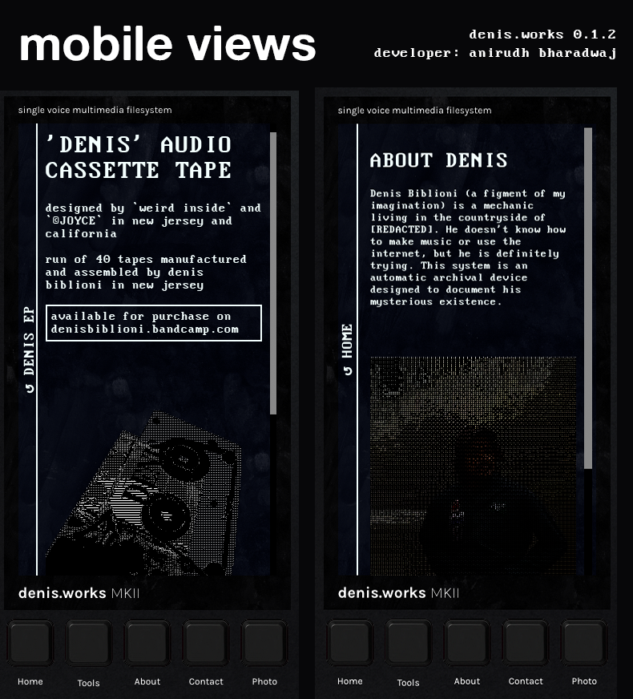
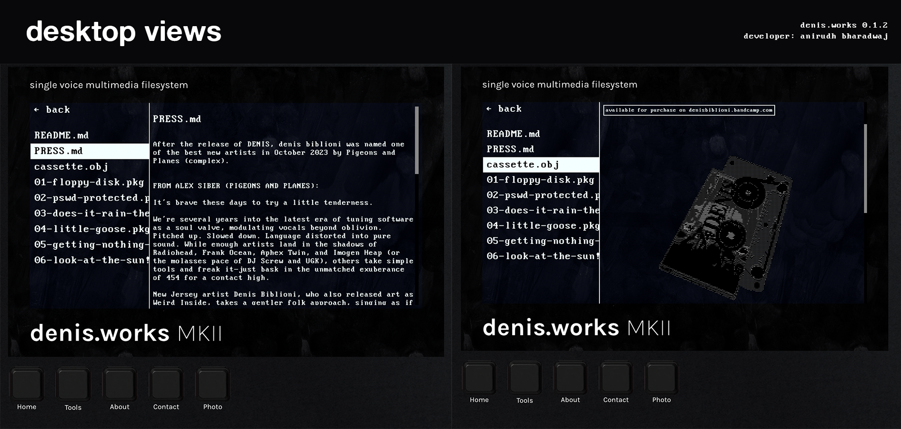

# denis.works

A website to showcase the work of artist project 'denis biblioni' by [weird inside](https://weirdinsi.de).

This project was created using React (Vite), ThreeJS (React Three Fiber), Framer Motion and React Router.

The UI is meant to meant to mimic an Elektron Octatrack II, but the UX is designed to function like a simple file explorer.

